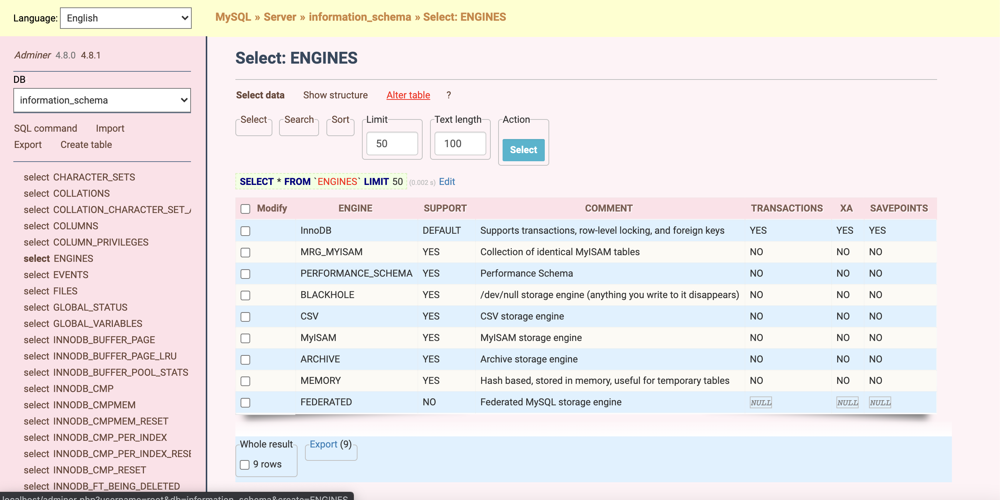

# Adminer Theme
This is my custom theme for adminer, for the girl-coders or someone like Pink Pastel! :stuck_out_tongue_winking_eye:

# Demo


# Installation

## With your machine
Copy `adminer.css` to the folder where `adminer.php` is located.

## With docker
The first, you need create directory like:
```
├── docker
│   ├── adminer
│   │   ├── pinkpastel
│   │   ├   ├── adminer.css
```

Then, change the `docker-compose.yml` content
```diff
version: '3'

services:
    ...
    adminer:
        restart: always
        image: adminer
+       volumes:
+            - ./docker/adminer/pinkpastel:/var/www/html/designs/pinkpastel
        expose:
            - "8080"
        ports:
            - "8088:8080"
        environment:
            ADMINER_DEFAULT_SERVER: mysql
-           ADMINER_DESIGN: "pappu687"
+           ADMINER_DESIGN: "pinkpastel"
```

Okay, restart docker and enjoy it now!

# Design
The design inspired by **uunnb** :sparkling_heart: